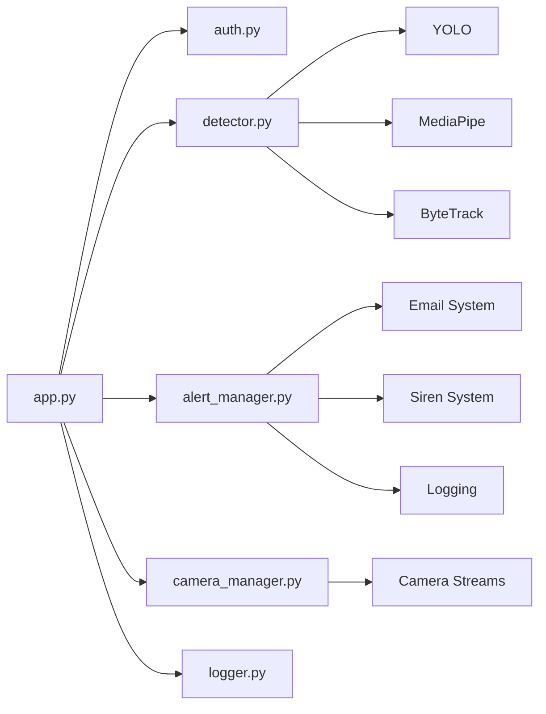

````md
# 🛡️ CampusGuard – AI-Powered Campus Security System


> 🚨 Real-time AI-powered surveillance system for campus safety using detection, tracking, behavioral analysis, and automated alerting.

---

## 📌 Project Summary

CampusGuard is a real-time intelligent surveillance system designed to enhance campus security using AI-based detection, behavior analysis, and automated alerts.

It integrates **YOLO object detection, ByteTrack tracking, and MediaPipe Pose analysis** to detect threats like weapons, violent activity, and abnormal behavior while maintaining stable real-time performance.

---

## 🎯 Key Highlights (ATS-Focused)

- ⚡ Real-time AI pipeline running at **20–22 FPS**  
- 🧠 Multi-model system (**YOLO + ByteTrack + MediaPipe Pose**)  
- 🎯 Reduced false positives using **Temporal Consensus (2-frame validation)**  
- 🚨 Multi-layer alert system (**Dashboard + Siren + Email**)  
- 🌙 Adaptive night vision with automatic switching  
- 🔐 Secure login with role-based access & brute-force protection  
- 🧩 Modular design supporting multi-camera scalability  

---

## 🧠 System Architecture

### 🔷 High-Level Flow

```mermaid
flowchart LR
    A[Camera Input] --> B[OpenCV Frame Capture]
    B --> C[YOLO Detection]
    C --> D[ByteTrack Tracking]
    D --> E[Behavior Analysis]
    E --> F[Temporal Consensus]
    F --> G[Alert Manager]

    G --> H1[Dashboard UI]
    G --> H2[PC Siren]
    G --> H3[Email Alerts]
    G --> H4[Screenshot Logging]
    G --> I[JSON Storage]
````

---

### ⚙️ Processing Pipeline

```mermaid
flowchart TD
    A[Video Frame] --> B{Frame Count % 3}

    B -->|Every Frame| C[YOLO + ByteTrack]
    B -->|Every 3rd Frame| D[Pose + ReID]

    C --> E[Detection Results]
    D --> E

    E --> F[Behavior Analysis]
    F --> G[Temporal Filtering]
    G --> H[Alert Decision]
```

---

### 🧩 Backend Architecture



---

## 🧠 Technology Stack

| Category        | Technologies                                     |
| --------------- | ------------------------------------------------ |
| Backend         | Python 3.9+, Flask, Flask-Login                  |
| AI/ML           | Ultralytics YOLO, MediaPipe Pose, PyTorch (CUDA) |
| Computer Vision | OpenCV, NumPy, ByteTrack                         |
| Frontend        | HTML5, CSS3 (Glassmorphism), Vanilla JS          |
| Storage         | Thread-safe JSON                                 |

---

## 🚀 Core Features

### 🟢 Real-Time AI Detection

* Weapon detection (knives, scissors, blunt objects)
* Person detection and tracking
* Temporal Consensus (2-frame validation)

---

### 🧍 Behavioral Analysis

* Person Re-Identification (ReID)
* Pose-based detection:

  * Aggressive strikes
  * Self-harm posture
  * Collapsed person
* Loitering detection (zone-based)
* Motion-based violence detection

---

### 🌙 Adaptive Night Vision

* NORMAL → RGB
* NIGHT → CLAHE + denoising
* THERMAL → heatmap
* AUTO → switches below 80 lux

---

### 🚨 Alert System

* Dashboard alerts with severity
* PC Siren (18 sec beep + red flash)
* Email alerts (HTML + screenshots)
* Evidence saved in `static/screenshots/`

---

### ⚡ Performance

| Metric  | Value     |
| ------- | --------- |
| FPS     | 20–22 FPS |
| Latency | ~40 ms    |
| VRAM    | ~3.8 GB   |

#### Optimizations:

* Frame throttling (heavy models every 3rd frame)
* GPU memory clearing (`torch.cuda.empty_cache()`)
* Cleanup every 100 frames
* Camera buffer limiting

---

### 🔐 Security

* Bcrypt password hashing
* Role-based access (Admin, Security Officer)
* Brute-force protection
* CLI management (`manage.py`)

---

### 🎥 Multi-Camera

* Modular architecture
* Supports multiple streams
* Currently configured for CAM-01

---

## 📂 Project Structure

```bash
CampusGuard_FINAL/
│
├── app.py
├── manage.py
├── requirements.txt
├── README.md
│
├── data/
│   ├── alerts.json
│   ├── email_config.json
│   ├── login_log.json
│   ├── unacknowledged.json
│   └── users.json
│
├── static/
│   ├── css/
│   ├── js/
│   └── screenshots/
│
├── templates/
│   ├── dashboard.html
│   └── login.html
│
├── utils/
│   ├── detector.py
│   ├── alert_manager.py
│   ├── auth.py
│   └── logger.py
│
├── zones/
│
└── yolo26s.pt
```

---

## ⚙️ Installation

```bash
python -m venv venv
```

```bash
# Windows
venv\Scripts\activate

# Mac/Linux
source venv/bin/activate
```

```bash
pip install -r requirements.txt
```

---

## ⚙️ Configuration

Edit:

```bash
data/email_config.json
```

Add your Gmail App Password.

---

## ▶️ Run

```bash
python app.py
```

---

## 🌐 Access

```
http://localhost:5000
```

**Default Login**

```
Username: admin
Password: Admin@123
```

---

## 🧩 Engineering Decisions

* Temporal filtering to reduce false positives
* Hybrid AI pipeline for accuracy + speed
* Frame throttling for stable FPS
* Modular backend for scalability
* Lightweight JSON storage (no DB overhead)

---

## 📌 Notes

* All features are fully implemented and tested
* No external integrations beyond listed stack
* Optimized for real-time GPU execution

---

## 👨‍💻 Author

**Manohar M**
B.E. Information Science Engineering

```

